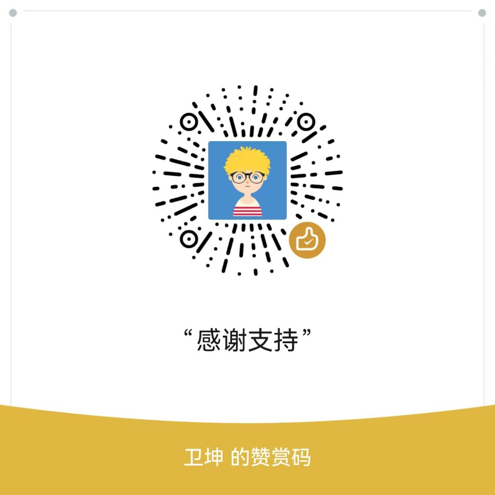

# claude-buddy

A desk-pet companion for AI coding sessions. Watch your buddy wake up when
work starts, get restless when a permission prompt is waiting, and approve
or deny risky commands from your phone instead of alt-tabbing back to the
IDE.

The project is a **mobile-first monorepo**: the **DevPet** Expo app is the
primary display and controller; your computer runs a local bridge and
lightweight hooks for Cursor and Claude Code. An optional ESP32 firmware
reference remains for hardware makers.

> **Design spec:** [`docs/superpowers/specs/2026-06-17-mobile-buddy-design.md`](docs/superpowers/specs/2026-06-17-mobile-buddy-design.md)

<p align="center">
  
</p>

## How it works

```text
┌─────────────────────────────────────────────────────────┐
│  Your computer (same Wi‑Fi)                             │
│                                                         │
│  Cursor / Claude Code                                   │
│       │ hook events (stdin JSON)                        │
│       ▼                                                 │
│  hooks/          POST ──►  bridge/                      │
│  cursor, claude-code       HTTP  :9876  ← hook ingress  │
│                            WS    :9877  ← phone link    │
│                            mDNS  _buddy._tcp            │
└───────────────────────────────┬─────────────────────────┘
                                │ WebSocket snapshots
                                ▼
┌─────────────────────────────────────────────────────────┐
│  Phone — DevPet (Expo app)                              │
│  • pet GIF per state (user-uploaded)                    │
│  • sessions tab: list, tap to focus, recent activity    │
│  • global approval modal + lock-screen notifications    │
│  • in-app sounds (expo-audio)                           │
│  • auto-connect, i18n (en / zh / ko / ru), settings     │
└─────────────────────────────────────────────────────────┘

firmware/  — optional ESP32 reference (BLE desk pet)
```

**Division of labour** (see
[`docs/adr/0002-host-bridge-owns-session-state.md`](docs/adr/0002-host-bridge-owns-session-state.md)):

| Piece | Owns |
| --- | --- |
| **Bridge** | Session state, pending decisions, hook responses, heartbeat |
| **Hooks** | Translate AI-tool events → bridge protocol |
| **App** | UI, pet rendering, user GIFs, notifications, local preferences |
| **Firmware** | Hardware reference only (makers / BLE enthusiasts) |

The phone does **not** talk to Claude Desktop over BLE. Integration is
hook-driven: Cursor agent hooks and Claude Code hooks POST to the bridge on
`127.0.0.1:9876`; the app receives compact JSON snapshots over WebSocket on
port `9877`.

## Installation

End-to-end setup: **desktop hooks + bridge** on your computer, **DevPet** on
your phone, both on the **same Wi‑Fi**.

### Prerequisites

| Requirement | Notes |
| --- | --- |
| **Python 3.10+** | Runs the bridge and hook adapters (`python3 --version`) |
| **Node.js 18+** | Optional but recommended — installs the `devpet-bridge` CLI (`node --version`) |
| **Git** | Clone this repo for hook installation (required for Cursor / Claude Code) |
| **Cursor** or **Claude Code** | Hook-driven integration; see [Cursor integration](#cursor-integration) |
| **Phone** | iOS or Android with [Expo Go](https://expo.dev/go), or a dev build for lock-screen notifications on Android |

Ports used locally (single bridge process):

| Port | Protocol | Used by |
| --- | --- | --- |
| `9876` | HTTP POST | `hooks/*` |
| `9877` | WebSocket | `app/` (phone) |

### Step 1 — Clone the repository

Hooks are installed into `~/.cursor/hooks.json` (and Claude Code config) with
**absolute paths** to this checkout, so you need a local clone even if you use
the npm CLI to start the bridge.

```bash
git clone https://github.com/weikunzl/ai-code-buddy.git
cd ai-code-buddy
# optional: git checkout feat/mobile-buddy
```

### Step 2 — One-time desktop setup (hooks + Python bridge)

From the repo root:

```bash
./tools/install-desktop.sh
```

This script:

1. `pip install -e bridge/` — makes `python3 -m bridge` available
2. `python3 hooks/cursor/install.py` — registers Cursor agent hooks
3. `python3 hooks/claude-code/install.py` — registers Claude Code hooks

Use a virtualenv if you prefer:

```bash
python3 -m venv .venv && source .venv/bin/activate
./tools/install-desktop.sh
```

Manual equivalent:

```bash
pip install -e bridge/
python3 hooks/cursor/install.py
python3 hooks/claude-code/install.py
```

Re-run `./tools/install-desktop.sh` or the individual `install.py` scripts
after pulling hook changes — installs are idempotent.

### Step 3 — Install the bridge CLI (optional, recommended)

The global CLI wraps the same shell scripts as the repo; useful when you do
not want to `cd` into the project to start the bridge.

```bash
npm install -g github:weikunzl/ai-code-buddy
```

Other install forms:

```bash
npm install -g git+https://github.com/weikunzl/ai-code-buddy.git
npm install -g github:weikunzl/ai-code-buddy#feat/mobile-buddy   # pin a branch
```

On install, `postinstall` runs `python3 -m pip install -e <global-package>/bridge`.
You still need **Step 2** from a git clone for hooks.

Commands:

| Command | What it does |
| --- | --- |
| `devpet-bridge restart` | Kill stale listeners on 9876/9877, start one bridge process (**recommended**) |
| `devpet-bridge start` | Start only if ports are free (does not kill existing listeners) |
| `devpet-bridge run …` | Pass-through to `python3 -m bridge …` |
| `devpet-bridge help` | Usage summary |

Skip this step if you only use the repo scripts in Step 4.

### Step 4 — Start the bridge

Pick **one** way to start. HTTP (`9876`) and WebSocket (`9877`) must be the
**same process**.

**With the CLI (after Step 3):**

```bash
devpet-bridge restart
```

**From the git clone:**

```bash
./tools/restart_bridge.sh          # recommended — kill stale + start
# ./tools/start_bridge.sh          # start only when ports are free
# python3 -m bridge --transport websocket --http-port 9876 --ws-port 9877
```

**Automatic start:** when a Cursor / Claude Code hook fires and nothing is
listening, hooks **auto-start** the bridge in the background
(`BUDDY_BRIDGE_AUTOSTART=1`, default). Logs: `.buddy/bridge.log`. Disable
with `BUDDY_BRIDGE_AUTOSTART=0`.

Environment variables:

| Variable | Default | Purpose |
| --- | --- | --- |
| `BUDDY_BRIDGE_URL` | `http://127.0.0.1:9876` | Hook POST target |
| `CURSOR_BUDDY_BRIDGE_URL` | (same) | Cursor-specific override |
| `BUDDY_HTTP_PORT` | `9876` | HTTP hook port |
| `BUDDY_WS_PORT` | `9877` | WebSocket port for phone |
| `BUDDY_BRIDGE_AUTOSTART` | `1` | Auto-start bridge from hooks |

**Troubleshooting:** if `push_test_prompt.py` times out while the phone is
connected, you likely have **two bridges** on different ports — run
`devpet-bridge restart` or `./tools/restart_bridge.sh`.

### Step 5 — Phone app (DevPet)

```bash
cd app
npm install
npm start          # Expo dev server — scan QR with Expo Go
```

On the phone:

1. Same **Wi‑Fi** as the computer.
2. Find your computer's **LAN IP** (not `127.0.0.1`).
3. Open DevPet → **Settings** → Bridge URL: `ws://<lan-ip>:9877` → **Connect**.
4. The app **auto-connects** to the last saved URL on later launches.

The in-app **Bridge setup** card (home / settings / sessions) shows the same
`npm install` and `devpet-bridge restart` commands.

**App behaviour (high level):**

| Feature | Detail |
| --- | --- |
| Auto-connect | Restores last `ws://` URL after launch |
| Reconnect | 10s interval, max 6 tries, then manual **Connect** on home |
| Sessions | Tap a row in **Sessions** to send `focus` and switch the home banner |
| Session counts | Only **active** sessions (`running` / `waiting`); stale rows pruned server-side |
| Sounds | In-app WAV cues via `expo-audio`; toggle in Settings |
| Notifications | Local notifications on iOS / dev builds; **Expo Go on Android uses in-app sounds only** (see below) |
| Language | English, 中文, 한국어, Русский — Settings → Language |
| Pet name | Rename companion on home screen (default: DevPet) |

**Notifications note:** `expo-notifications` is **not** bundled for Expo Go on Android
(SDK 53+ blocks push/local notification APIs at startup). Approval alerts still
play **in-app sounds** via `expo-audio`. For lock-screen notifications on
Android, create a dev build (`npx expo run:android`) and
`npm install expo-notifications`, then add the plugin sounds block to
`app.json` (see Expo docs).

### Step 6 — Verify

```bash
# From repo root — approval round-trip (HTTP hook → phone modal)
python3 tools/push_test_prompt.py

# Hook adapter unit tests
python3 tools/test_cursor_hook.py
python3 tools/test_bridge_http.py

# Bridge simulator (no phone)
python3 -m bridge --simulate --once
python3 -m bridge --simulate --once --simulate-profile permission

# App unit tests
cd app && npm test
```

Checklist:

- [ ] `lsof -i :9876 -i :9877` shows **one** Python process on both ports
- [ ] DevPet home shows **Watching sessions…** (or pet state other than sleep)
- [ ] `push_test_prompt.py` opens an approval modal on the phone

### Installation paths (summary)

| Goal | Clone repo | `install-desktop.sh` | `npm install -g` | Start bridge |
| --- | --- | --- | --- | --- |
| **Full setup** (recommended) | yes | yes | optional | `devpet-bridge restart` or `./tools/restart_bridge.sh` |
| **Contributors** | yes | yes | optional | `./tools/restart_bridge.sh` |
| **Bridge CLI only** | no* | no | yes | `devpet-bridge restart` |

\*CLI-only works for starting the bridge, but **hooks require a clone** (Step 1–2)
for Cursor / Claude Code integration.

## Quick reference

```bash
# One-time (from clone)
./tools/install-desktop.sh
npm install -g github:weikunzl/ai-code-buddy   # optional CLI

# Every session / after reboot
devpet-bridge restart                            # or ./tools/restart_bridge.sh

# Phone
cd app && npm start
# Settings → ws://192.168.x.x:9877 → Connect

# Smoke test
python3 tools/push_test_prompt.py
```

## Cursor integration

[`hooks/cursor/hook.py`](hooks/cursor/hook.py) maps [Cursor agent hooks](https://cursor.com/docs/hooks) into the bridge's `hook_event_name` payloads. Cursor and Claude Code can share one buddy.

| Cursor hook | Bridge event | Buddy effect |
| --- | --- | --- |
| `sessionStart` | `SessionStart` | session appears, pet wakes |
| `beforeSubmitPrompt` | `UserPromptSubmit` | shows prompt (observe only) |
| `beforeShellExecution` | `PreToolUse` / `Notification` | risky commands wait for approval; safe commands log activity only |
| `afterShellExecution` | — | (observe logged in `beforeShell`; no duplicate line) |
| `afterFileEdit` | `Notification` | updates activity |
| `stop` | `Stop` | session completes, celebrate event |

Install (idempotent; preserves unrelated hooks):

```bash
python3 hooks/cursor/install.py            # install / update
python3 hooks/cursor/install.py --print    # preview hooks.json
python3 hooks/cursor/install.py --remove   # uninstall
```

Approval gating (`CURSOR_BUDDY_APPROVE`):

| Value | Behavior |
| --- | --- |
| `risky` (default) | destructive / network commands block for phone approve/deny |
| `all` | every shell command waits |
| `off` | observe only, never block |

If the app does not answer within `CURSOR_BUDDY_TIMEOUT` (default 25s), the
adapter **fails open** — Cursor's normal prompt takes over.

Hooks inject the repository root into `PYTHONPATH` so they work when Cursor
runs them from an arbitrary project directory.

## The seven pet states

| State | Trigger | Feel |
| --- | --- | --- |
| `sleep` | bridge not connected | resting |
| `idle` | connected, nothing urgent | calm |
| `busy` | sessions actively running | working |
| `attention` | approval or choice pending | alert |
| `celebrate` | session complete / level up | happy |
| `heart` | approved in under 5s | hearts |
| `dizzy` | — on phone (no IMU in MVP) | hardware only |

## Custom pet GIFs (phone)

On DevPet, users pick their own GIFs from the photo library — one per
state (or leave blank to use built-in placeholders). Files stay in the app
sandbox; the bridge never receives character assets. The pet editor shows
**when each state triggers** (sleep, idle, busy, etc.).

```json
{
  "version": 1,
  "name": "my-cat",
  "states": {
    "sleep": "file:///…/sleep.gif",
    "idle": "file:///…/idle.gif",
    "attention": "file:///…/alert.gif"
  }
}
```

This is **not** the firmware character-pack format. Hardware GIF packs
(`manifest.json` + 96px GIFs pushed over BLE) remain documented under
[`firmware/`](firmware/) for makers.

## Project layout

```text
claude-buddy/
├── packages/protocol/     # JSON Schema + shared TS/Python types
├── bridge/                # Python daemon: state, HTTP, WebSocket, mDNS
├── hooks/
│   ├── common/            # relay, HTTP client
│   ├── cursor/
│   └── claude-code/
├── app/                   # Expo DevPet (Zustand + WebSocket client)
├── firmware/              # ESP32 reference
│   ├── src/
│   ├── platformio.ini
│   └── characters/        # example BLE character packs
├── docs/
│   ├── REFERENCE.md       # hardware BLE wire protocol
│   └── protocol/          # mobile WebSocket protocol
├── package.json           # devpet-cli (global devpet-bridge command)
├── bin/                   # devpet-bridge entrypoint
└── tools/                 # dev scripts, tests, installers
```

| Legacy path | Current |
| --- | --- |
| `tools/session_bridge.py` | `python3 -m bridge` |
| `tools/cursor_hook.py` | `hooks/cursor/hook.py` |
| `tools/cursor_buddy_install.py` | `hooks/cursor/install.py` |
| `tools/hook_relay.py` | `hooks/common/relay.py` |

## Protocol

| Document | Audience |
| --- | --- |
| [`REFERENCE.md`](REFERENCE.md) | Hardware makers (BLE Nordic UART) |
| [`docs/superpowers/specs/2026-06-17-mobile-buddy-design.md`](docs/superpowers/specs/2026-06-17-mobile-buddy-design.md) | Mobile + bridge architecture |
| [`docs/protocol/mobile-bridge.md`](docs/protocol/mobile-bridge.md) | WebSocket frame detail |

**Mobile WebSocket (summary):** bridge pushes `snapshot` heartbeats (same
fields as the hardware heartbeat + session-console extensions). The app
sends intent commands the firmware already understands:

```json
{"cmd":"permission","id":"req_123","decision":"once"}
{"cmd":"permission","id":"req_123","decision":"deny"}
{"cmd":"answer","id":"q_transport","choice":"usb"}
{"cmd":"focus","sid":"s_abc"}
```

**Session lifecycle (bridge):** sessions are keyed by `session_id`. Completed
sessions stay visible in the app for **24 hours**; any session without hook
updates for 24h is pruned. `total` counts only active (`running` / `waiting`)
sessions.

## Hook relay and choice prompts

Relay one hook event into the bridge:

```bash
python3 -m bridge --transport serial --serial-port /dev/tty.usbmodem...
printf '%s\n' '{"hook_event_name":"UserPromptSubmit","session_id":"s_demo","cwd":"'"$PWD"'","prompt":"run tests"}' \
  | python3 hooks/common/relay.py
```

Post a choice prompt for integration tests:

```bash
curl -sS http://127.0.0.1:9876 -X POST -H 'content-type: application/json' -d '{
  "hook_event_name":"Notification",
  "session_id":"s_demo",
  "cwd":"'"$PWD"'",
  "message":"Choose transport",
  "prompt":{
    "id":"q_transport",
    "kind":"single_choice",
    "title":"Transport",
    "body":"pick transport",
    "options":[
      {"id":"ble","label":"BLE"},
      {"id":"usb","label":"USB"}
    ]
  }
}'
```

More examples (including CJK payloads):
[`docs/upstream-workflow-examples.md`](docs/upstream-workflow-examples.md).

Helper scripts: `tools/post_notification_prompt.py`, `tools/push_test_prompt.py`,
`devpet-bridge`, `tools/restart_bridge.sh`, `tools/start_bridge.sh`,
`tools/bridge_ws_probe.py`.

## Hardware reference (ESP32)

The original M5StickC / StickS3 desk pet remains as an optional reference
implementation for makers. It pairs with **Claude Desktop** over BLE when
developer mode is enabled (**Developer → Open Hardware Buddy…**).

```bash
cd firmware
pio run -t upload
```

Controls, sound roles, UTF-8/CJK rendering, ASCII species, BLE character
push, and microphone notes are documented in the git history under
`firmware/`. Makers should still read [`REFERENCE.md`](REFERENCE.md) —
you do not need this repository's app code to build a BLE device.

## Development

See [Installation](#installation) for first-time setup. Day-to-day:

```bash
# Firmware
cd firmware && pio run
cd firmware && pio run -e m5sticks3

# Bridge + hooks
python3 tools/test_session_bridge.py
python3 tools/test_bridge_http.py
python3 tools/test_cursor_hook.py
devpet-bridge restart    # or ./tools/restart_bridge.sh

# App
cd app && npm test

# Simulate approval cycle
python3 -m bridge --simulate --once --simulate-profile permission
```

See [`AGENTS.md`](AGENTS.md) for contributor conventions and
[`CONTRIBUTING.md`](CONTRIBUTING.md) for PR expectations.

## Roadmap

| Phase | Status | Work |
| --- | --- | --- |
| **M1** | done | Move firmware to `firmware/` |
| **M2** | done | Extract `bridge/` + `packages/protocol` |
| **M3** | done | Move hooks; WebSocket transport + mDNS |
| **M4** | done | Ship Expo `app/` with LAN approval loop |
| **Next** | — | mDNS auto-pair in app, dev build for custom notification sounds, optional `preToolUse` on phone |

## 赞助支持

DevPet / claude-buddy 从固件参考、Bridge、Hooks 到手机 App，都是业余时间一点点打磨出来的。  
如果这个工具帮你省了来回切屏、让写代码时多了一点陪伴感，欢迎请我喝杯咖啡 ☕️  
**创作不易，感谢每一份支持！**

| 支付宝 | 微信 |
| --- | --- |
|  |  |

也欢迎通过 [GitHub Sponsors](https://github.com/sponsors/weikunzl) 支持（配置中）。  
你的鼓励是我继续维护和改进这个项目的动力。

## Availability

Claude Desktop's BLE Hardware Buddy API requires developer mode and is
intended for makers — not a supported product surface. The hook + bridge +
phone path in this repository is a local, opt-in developer tool. It does not
send session data to third-party servers in the MVP design (LAN only).
