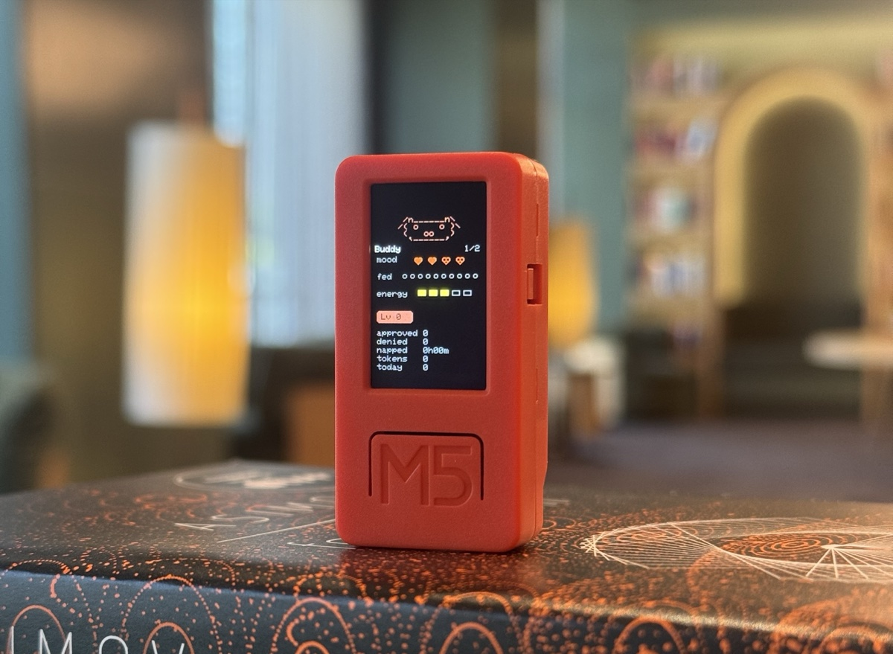

# claude-buddy

A desk-pet companion for AI coding sessions. Watch your buddy wake up when
work starts, get restless when a permission prompt is waiting, and approve
or deny risky commands from your phone instead of alt-tabbing back to the
IDE.

The project is evolving from an ESP32 hardware reference into a **mobile-first
monorepo**: a phone app is the primary display and controller; your computer
runs a local bridge and lightweight hooks for Cursor and Claude Code.

> **Design spec:** [`docs/superpowers/specs/2026-06-17-mobile-buddy-design.md`](docs/superpowers/specs/2026-06-17-mobile-buddy-design.md)

<p align="center">
  
</p>

## How it works

```text
┌─────────────────────────────────────────────────────────┐
│  Your computer (same Wi‑Fi)                             │
│                                                         │
│  Cursor / Claude Code                                   │
│       │ hook events (stdin JSON)                        │
│       ▼                                                 │
│  hooks/          POST ──►  bridge/                      │
│  cursor, claude-code       HTTP  :9876  ← hook ingress  │
│                            WS    :9877  ← phone link    │
│                            mDNS  _buddy._tcp            │
└───────────────────────────────┬─────────────────────────┘
                                │ WebSocket snapshots
                                ▼
┌─────────────────────────────────────────────────────────┐
│  Phone (Expo app)                                       │
│  • pet GIF for each state (user-uploaded)               │
│  • session list + approval / choice UI                  │
│  • sounds, settings, LAN pairing                        │
└─────────────────────────────────────────────────────────┘

firmware/  — optional ESP32 reference (BLE desk pet)
```

**Division of labour** (see
[`docs/adr/0002-host-bridge-owns-session-state.md`](docs/adr/0002-host-bridge-owns-session-state.md)):

| Piece | Owns |
| --- | --- |
| **Bridge** | Session state, pending decisions, hook responses, heartbeat |
| **Hooks** | Translate AI-tool events → bridge protocol |
| **App** | UI, pet rendering, user GIFs, local preferences |
| **Firmware** | Hardware reference only (makers / BLE enthusiasts) |

The phone does **not** talk to Claude Desktop over BLE. Integration is
hook-driven: Cursor agent hooks and Claude Code hooks POST to the bridge on
`127.0.0.1:9876`; the app receives compact JSON snapshots over WebSocket on
port `9877`.

## Quick start

### 1. Desktop — bridge + hooks

**Today** (pre-migration layout):

```bash
# Terminal 1 — bridge (stdout simulator for smoke test)
python3 tools/session_bridge.py --simulate

# Terminal 2 — Cursor hooks
python3 tools/cursor_buddy_install.py
python3 tools/session_bridge.py --transport ble    # or serial / websocket (planned)
```

**Target** (after migration):

```bash
./tools/install-desktop.sh
# pip install -e bridge/
# python -m hooks.cursor.install
# python -m hooks.claude-code.install
python -m bridge --http-port 9876 --ws-port 9877
```

The bridge exposes:

| Port | Protocol | Used by |
| --- | --- | --- |
| `9876` | HTTP POST | `hooks/*` |
| `9877` | WebSocket | `app/` (phone) |

Hooks read `BUDDY_BRIDGE_URL` (default `http://127.0.0.1:9876`). Cursor
also honours `CURSOR_BUDDY_BRIDGE_URL`.

### 2. Phone — Expo app

The mobile app lives in [`app/`](app/). MVP uses **manual bridge URL** in
Settings (mDNS discovery deferred).

1. Phone and computer on the **same Wi‑Fi**.
2. Start the bridge with WebSocket transport (see desktop section above).
3. Open the app → **Settings** → enter `ws://<your-mac-ip>:9877` → **Connect**.
4. Pet wakes (`idle`); permission and choice prompts appear as a modal.

```bash
cd app && npm install && npx expo start
cd app && npm test    # Jest unit tests (derivePetState, frame parser)
```

### 3. Smoke test without hardware or phone

```bash
python3 tools/session_bridge.py --simulate --once
python3 tools/session_bridge.py --simulate --once --simulate-profile single
python3 tools/test_session_bridge.py
python3 tools/test_cursor_hook.py
```

## Cursor integration

[`tools/cursor_hook.py`](tools/cursor_hook.py) maps [Cursor agent hooks](https://cursor.com/docs/hooks) into the bridge's `hook_event_name` payloads. Cursor and Claude Code can share one buddy.

| Cursor hook | Bridge event | Buddy effect |
| --- | --- | --- |
| `sessionStart` | `SessionStart` | session appears, pet wakes |
| `beforeSubmitPrompt` | `UserPromptSubmit` | shows prompt (observe only) |
| `beforeShellExecution` | `PreToolUse` / `Notification` | risky commands wait for approval |
| `afterShellExecution` | `Notification` | updates activity |
| `afterFileEdit` | `Notification` | updates activity |
| `stop` | `Stop` | done / celebrate |

Install (idempotent; preserves unrelated hooks):

```bash
python3 tools/cursor_buddy_install.py            # install / update
python3 tools/cursor_buddy_install.py --print    # preview hooks.json
python3 tools/cursor_buddy_install.py --remove   # uninstall
```

Approval gating (`CURSOR_BUDDY_APPROVE`):

| Value | Behavior |
| --- | --- |
| `risky` (default) | destructive / network commands block for phone approve/deny |
| `all` | every shell command waits |
| `off` | observe only, never block |

If the app does not answer within `CURSOR_BUDDY_TIMEOUT` (default 25s), the
adapter **fails open** — Cursor's normal prompt takes over.

## The seven pet states

| State | Trigger | Feel |
| --- | --- | --- |
| `sleep` | bridge not connected | resting |
| `idle` | connected, nothing urgent | calm |
| `busy` | sessions actively running | working |
| `attention` | approval or choice pending | alert |
| `celebrate` | session complete / level up | happy |
| `heart` | approved in under 5s | hearts |
| `dizzy` | — on phone (no IMU in MVP) | hardware only |

## Custom pet GIFs (phone)

On the phone app, users pick their own GIFs from the photo library — one per
state (or leave blank to use built-in defaults). Files stay in the app
sandbox; the bridge never receives character assets.

```json
{
  "version": 1,
  "name": "my-cat",
  "states": {
    "sleep": "file:///…/sleep.gif",
    "idle": "file:///…/idle.gif",
    "attention": "file:///…/alert.gif"
  }
}
```

This is **not** the firmware character-pack format. Hardware GIF packs
(`manifest.json` + 96px GIFs pushed over BLE) remain documented under
[`firmware/`](firmware/) for makers.

## Project layout

```text
claude-buddy/
├── packages/protocol/     # JSON Schema + shared TS/Python types
├── bridge/                # Python daemon: state, HTTP, WebSocket, mDNS
├── hooks/
│   ├── common/            # relay, HTTP client
│   ├── cursor/
│   └── claude-code/
├── app/                   # Expo React Native (Zustand + WebSocket client)
├── firmware/              # ESP32 reference
│   ├── src/
│   ├── platformio.ini
│   └── characters/        # example BLE character packs
├── docs/
│   ├── REFERENCE.md       # hardware BLE wire protocol
│   └── protocol/          # mobile WebSocket protocol
└── tools/                 # dev scripts, tests, installers
```

| Legacy path (today) | Target |
| --- | --- |
| `tools/session_bridge.py` | `bridge/` |
| `tools/cursor_hook.py` | `hooks/cursor/hook.py` |
| `tools/hook_relay.py` | `hooks/common/relay.py` |

## Protocol

| Document | Audience |
| --- | --- |
| [`REFERENCE.md`](REFERENCE.md) | Hardware makers (BLE Nordic UART) |
| [`docs/superpowers/specs/2026-06-17-mobile-buddy-design.md`](docs/superpowers/specs/2026-06-17-mobile-buddy-design.md) | Mobile + bridge architecture |
| `docs/protocol/mobile-bridge.md` | WebSocket frame detail |

**Mobile WebSocket (summary):** bridge pushes `snapshot` heartbeats (same
fields as the hardware heartbeat + session-console extensions). The app
sends intent commands the firmware already understands:

```json
{"cmd":"permission","id":"req_123","decision":"once"}
{"cmd":"answer","id":"q_transport","choice":"usb"}
```

## Hook relay and choice prompts

Relay one hook event into the bridge:

```bash
python3 tools/session_bridge.py --transport serial --serial-port /dev/tty.usbmodem...
printf '%s\n' '{"hook_event_name":"UserPromptSubmit","session_id":"s_demo","cwd":"'"$PWD"'","prompt":"run tests"}' \
  | python3 tools/hook_relay.py
```

Post a choice prompt for integration tests:

```bash
curl -sS http://127.0.0.1:9876 -X POST -H 'content-type: application/json' -d '{
  "hook_event_name":"Notification",
  "session_id":"s_demo",
  "cwd":"'"$PWD"'",
  "message":"Choose transport",
  "prompt":{
    "id":"q_transport",
    "kind":"single_choice",
    "title":"Transport",
    "body":"pick transport",
    "options":[
      {"id":"ble","label":"BLE"},
      {"id":"usb","label":"USB"}
    ]
  }
}'
```

More examples (including CJK payloads):
[`docs/upstream-workflow-examples.md`](docs/upstream-workflow-examples.md).

Helper scripts: `tools/post_notification_prompt.py`, `tools/hook_relay.py`.

## Hardware reference (ESP32)

The original M5StickC / StickS3 desk pet remains as an optional reference
implementation for makers. It pairs with **Claude Desktop** over BLE when
developer mode is enabled (**Developer → Open Hardware Buddy…**).

```bash
cd firmware
pio run -t upload
```

Controls, sound roles, UTF-8/CJK rendering, ASCII species, BLE character
push, and microphone notes are documented in the git history under
`firmware/`. Makers should still read [`REFERENCE.md`](REFERENCE.md) —
you do not need this repository's app code to build a BLE device.

## Development

```bash
# Firmware
cd firmware && pio run
cd firmware && pio run -e m5sticks3

# Bridge tests
python3 tools/test_session_bridge.py
python3 tools/test_session_frames.py
python3 tools/test_cursor_hook.py

# Simulate approval cycle
python3 tools/session_bridge.py --simulate --once --simulate-profile permission
```

See [`AGENTS.md`](AGENTS.md) for contributor conventions and
[`CONTRIBUTING.md`](CONTRIBUTING.md) for PR expectations.

## Roadmap

| Phase | Work |
| --- | --- |
| **M1** | Move firmware to `firmware/` |
| **M2** | Extract `bridge/` + `packages/protocol` |
| **M3** | Move hooks; add WebSocket transport + mDNS |
| **M4** | Ship Expo `app/` with LAN approval loop |

## Availability

Claude Desktop's BLE Hardware Buddy API requires developer mode and is
intended for makers — not a supported product surface. The hook + bridge +
phone path in this repository is a local, opt-in developer tool. It does not
send session data to third-party servers in the MVP design (LAN only).
